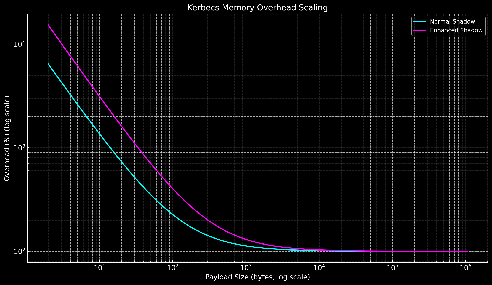

<p align="center">
  
</p>

---

# Kerbecs 🔒
**Kerbecs** is a lightweight, surgical **address sanitizer** designed for **allocator debugging, redzone/canary protection, and memory corruption detection** in high-performance systems.  

Unlike heavy sanitizers (ASan/MSan), Kerbecs is engineered for **low-overhead, allocator-driven correctness checking**. It’s built as part of the **Spectra runtime toolchain** but is fully standalone.

---

## ✨ Features

- 🧩 **Trusted Shadow Handles**  
  Every allocation gets a trusted shadow (`Shadow` or `EnhancedShadow`) that tracks offsets, alignment, and total size.

- 🛡️ **Redzones & Canaries**  
  - Redzones (default ≥16B, dynamically sized by alignment).  
  - Canaries (default ≥8B, dynamically sized).  
  - Detects buffer underflow/overflow with surgical precision.  

- ☠️ **Poison & Tombstones**  
  - Payload bytes poisoned/unpoisoned via shadow map.  
  - Freed blocks tombstoned with `0xDD`.  

- 🔗 **Shadowzone Mapping**  
  - 2 TiB reserved virtual space (default).  
  - 1.5 TiB = shadowzone (1 shadow byte per 8 user bytes).  
  - 0.5 TiB = global zone (metadata + diagnostics).  

- 🔬 **Normal vs Enhanced Modes**  
  - **Normal**: Minimal metadata, fast.  
  - **Enhanced**: Extra per-thread hash, checksums, dual metadata, canaries.  

- 🧮 **Fast Hashing**  
  - Uses `splitMix64` for allocator/thread hashes.  
  - Cheap, high-quality distribution.  

---

## 🖼️ Memory Model

<p align="center">
  
</p>

A protected allocation in **Enhanced Mode** looks like this:

```
[ REDZONE ][ MetaData ][ CANARY ][ PAYLOAD ][ CANARY ][ MetaData ][ REDZONE ]
```

Mapped into the shadowzone like this:

```
PAYLOAD → [shadow bytes covering payload only]
```

---

## ⚙️ API Overview

### Initialization
```cpp
// Normal mode
bool init(SHP shadow, void* memory, size_t blockSize, size_t count=1);

// Enhanced mode
bool init(ESHP shadow, void* memory, size_t blockSize, size_t count=1);
```

### Shadow Mapping
```cpp
void* mapToShadow(void* userPtr, size_t size);
UserRange mapToUser(void* shadowPtr, const KerbecsMemoryZone& zone);
```

### Poisoning & Verification
```cpp
bool poison(SHP shadow, size_t offset);
bool unPoison(SHP shadow, size_t offset);
bool verifyRedzone(SHP shadow);
bool tombstone(SHP shadow, size_t offset);
```

---

## 🚀 Philosophy

Kerbecs is not a replacement for **AddressSanitizer** — it is:
- **Lightweight** (minimal runtime cost).  
- **Surgical** (precise alignment, no fuzz).  
- **Allocator-driven** (integrates directly with StormSTL / Spectra allocators).  

**Kerbecs catches footguns, not every possible memory bug.**  
It’s a watchdog — tuned for HPC and systems development where full ASan overhead is unacceptable.

---

## 📦 Building

Kerbecs uses **CMake**. Shadowzone sizes are passed as compile-time constants:

```cmake
add_compile_definitions(
  KERBECS_SHADOWZONE_SIZE=$<1.5_TiB>
  KERBECS_GLOBALZONE_SIZE=$<0.5_TiB>
)
```

---

## 📜 License

Kerbecs is licensed under the [MIT License](https://opensource.org/licenses/MIT).  

---